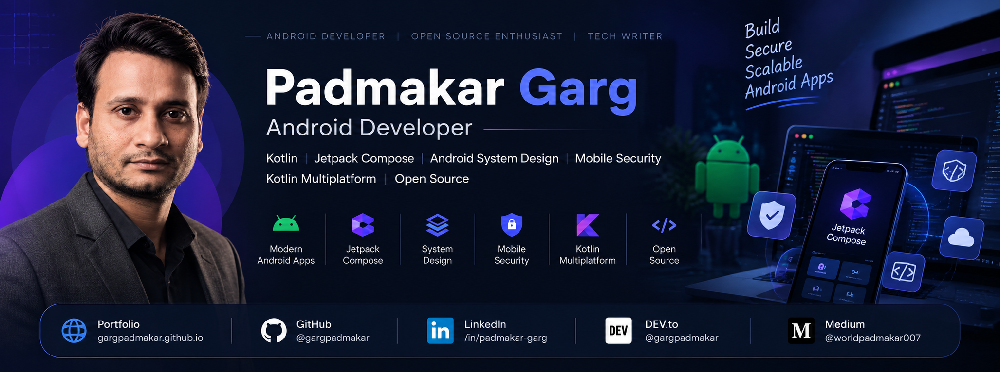

<div align="center">



<br/>

# Padmakar Garg

### Android Developer · Kotlin · Jetpack Compose · Android System Design · Mobile Security

Building secure, scalable and production-ready Android applications, SDKs and open-source tools.

<br/>

<a href="https://gargpadmakar.github.io/">
  
</a>
<a href="https://github.com/gargpadmakar">
  
</a>
<a href="https://www.linkedin.com/in/padmakar-garg">
  
</a>
<a href="https://dev.to/gargpadmakar">
  
</a>
<a href="https://medium.com/@worldpadmakar007">
  
</a>

</div>

---

## About Me

I'm **Padmakar Garg**, an **Android Developer with 8+ years of experience** building scalable, secure and high-performance mobile applications.

My engineering focus is on:

- Native Android development with **Kotlin**
- Modern UI with **Jetpack Compose & Material 3**
- **Android System Design & Architecture**
- **Mobile Application Security**
- **Kotlin Multiplatform (KMP)**
- Clean Architecture, MVVM & UseCase-driven design
- Networking, real-time communication and background processing
- Building reusable **Android SDKs and open-source libraries**

I enjoy working on products where **architecture, performance, security and maintainability** matter.

---

## Engineering Expertise

| Area | Expertise |
| --- | --- |
| **Android** | Kotlin, Android SDK, Jetpack Compose, Material 3 |
| **Architecture** | MVVM, Clean Architecture, UseCase, Modularization |
| **Async & Data** | Coroutines, Flow, Room, DataStore, Paging 3 |
| **Networking** | Retrofit, REST APIs, WebSockets, Ktor |
| **Real-time** | WebRTC, LiveKit, Socket.IO |
| **Security** | Encryption, authentication, secure API communication, mobile security |
| **Multiplatform** | Kotlin Multiplatform (KMP) |
| **Background** | WorkManager, notifications, background processing |
| **Testing** | JUnit, Espresso, Mockito |
| **DevOps** | GitHub Actions, CI/CD, Jenkins, Bitrise |
| **Open Source** | Android libraries, SDKs and developer tooling |

---

## Technology Stack

<div align="center">

### Android & Kotlin


### Modern Android


### Data & Networking


</div>

---

# SDKs, Libraries & Open Source

I also build reusable developer tools and Android libraries focused on **analytics, security and production-grade mobile development**.

### ScreenAnalytics — Android Screen Analytics SDK

**ScreenAnalytics** is an Android/Compose-focused library for tracking screen views and navigation analytics with a reusable developer-friendly API.

**Focus:**
- Screen view tracking
- Jetpack Compose support
- Reusable analytics architecture
- Library-first design
- Open-source distribution
- JitPack publishing

**Repository:**  
https://github.com/gargpadmakar/screen-analytics-android

---

### AppProtectGuard — Mobile Security Library

**AppProtectGuard** is an open-source Android security-focused project designed around practical mobile application protection and secure development concepts.

**Focus:**
- Android application security
- Security-focused utilities
- Secure coding practices
- Protection-oriented mobile development
- Reusable Android components

---

## Selected Product Work

### Samwad — Secure Communication

A secure communication application with modern Android architecture and real-time communication capabilities.

**Focus:** Android · Kotlin · Jetpack Compose · Real-time Communication · Security

---

### Ritam News

A modern news application featuring articles, Shorts, deep links, in-app browsing, content sharing and multimedia experiences.

**Focus:** Kotlin · Jetpack Compose · KMP · WebView · Deep Linking · Networking

---

### Simplisync — Lead CRM

A mobile CRM solution focused on lead management and business workflows.

**Focus:** Android · Kotlin · REST APIs · Data Management · Clean Architecture

---

### FikFis — Smart Shopping

A mobile shopping experience designed around modern Android UI and scalable application architecture.

**Focus:** Android · Kotlin · Modern UI · API Integration

---

## Android System Design

I write and learn about Android system design from a practical **Android Developer perspective**.

Topics I focus on:

- Application architecture
- Modularization
- Offline-first design
- Networking architecture
- Caching strategies
- Database design
- Background processing
- Push notifications
- Real-time communication
- Authentication & authorization
- Encryption & key management
- Scalability and reliability
- Performance optimization
- Observability and logging

### Typical Architecture

```text
                ┌─────────────────────┐
                │     Presentation    │
                │  Compose / UI State  │
                └──────────┬──────────┘
                           │
                ┌──────────▼──────────┐
                │      ViewModel       │
                │   State / Events     │
                └──────────┬──────────┘
                           │
                ┌──────────▼──────────┐
                │       UseCase        │
                │   Business Logic     │
                └──────────┬──────────┘
                           │
                ┌──────────▼──────────┐
                │      Repository      │
                │ Contract / Abstraction│
                └──────────┬──────────┘
                           │
             ┌─────────────┴─────────────┐
             │                           │
     ┌───────▼────────┐         ┌────────▼───────┐
     │  Remote Data   │         │   Local Data   │
     │ REST/WebSocket │         │ Room/DataStore │
     └────────────────┘         └────────────────┘
```

---

## Mobile Security

Security is one of my core areas of interest, especially for Android applications handling sensitive data and APIs.

Areas I work with and study:

- Symmetric & asymmetric encryption
- AES-based data protection
- ECDH key exchange
- Secure API communication
- Authentication mechanisms
- Secure token handling
- Key management
- Native-layer security
- Secure WebSocket communication
- Application integrity
- Secure storage and data handling

My approach is to treat security as an **architecture concern**, not something added only at the end of development.

---

## Technical Writing

I regularly write about Android development, architecture, system design, security and practical engineering.

- **DEV.to:** https://dev.to/gargpadmakar
- **Medium:** https://medium.com/@worldpadmakar007
- **Portfolio:** https://gargpadmakar.github.io/

Topics include:

- Android System Design
- Jetpack Compose
- Android Architecture
- Mobile Security
- Kotlin & Coroutines
- Kotlin Multiplatform
- Open-source Android libraries
- Production Android engineering

---

## GitHub Activity

<div align="center">


<br/><br/>


</div>

---

## What I Build

```text
┌───────────────────────────────────────────────────────┐
│                   PADMAKAR GARG                       │
├───────────────────────────────────────────────────────┤
│                                                       │
│  Android Apps        → Secure & Scalable Products     │
│  Android SDKs        → Reusable Developer Tools       │
│  System Design       → Reliable Mobile Architecture   │
│  Mobile Security     → Security-first Engineering     │
│  Open Source         → Libraries & Knowledge Sharing  │
│                                                       │
└───────────────────────────────────────────────────────┘
```

---

## Connect With Me

<div align="center">

| Platform | Link |
| --- | --- |
| **Portfolio** | https://gargpadmakar.github.io/ |
| **GitHub** | https://github.com/gargpadmakar |
| **LinkedIn** | https://www.linkedin.com/in/padmakar-garg |
| **DEV.to** | https://dev.to/gargpadmakar |
| **Medium** | https://medium.com/@worldpadmakar007 |

</div>

---

<div align="center">

### Android Developer • System Design • Mobile Security • SDKs • Open Source

**Building secure, scalable and meaningful mobile experiences.**

</div>
